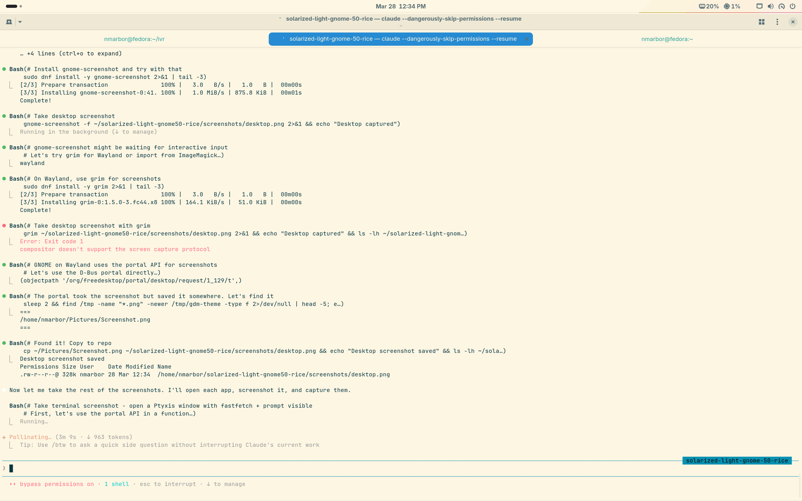
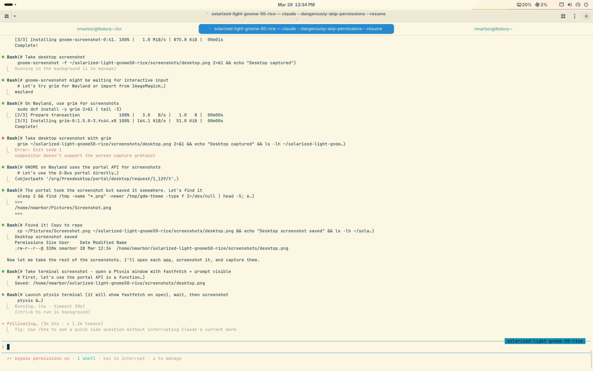
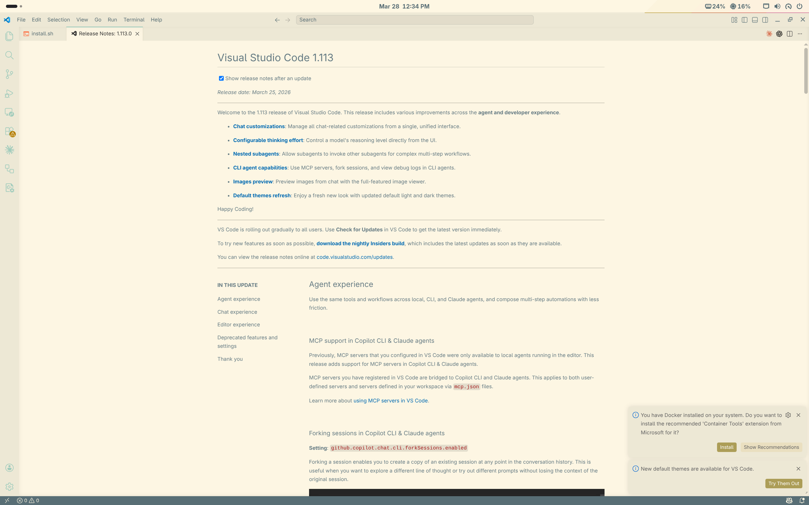
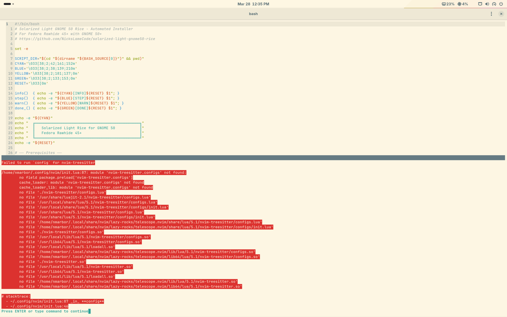
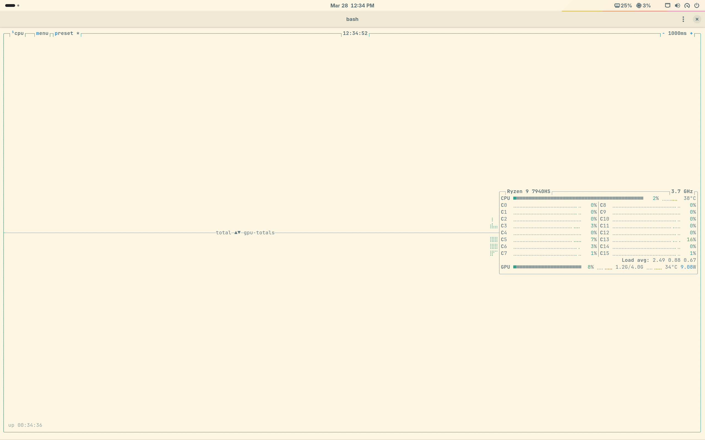
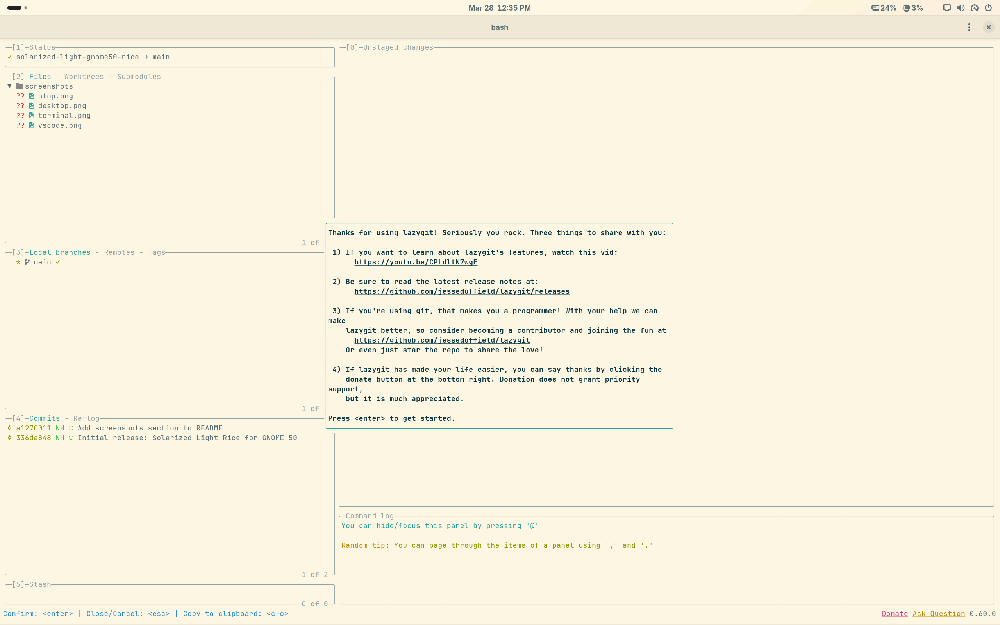

<p align="center">
  
</p>

<h1 align="center">Solarized Light Rice for GNOME 50</h1>

<p align="center">
  <strong>Every surface. Every app. Every pixel. Solarized Light.</strong>
</p>

<p align="center">
  
  
  
  
  
</p>

<p align="center">
  
</p>

---

## Table of Contents

- [Screenshots](#screenshots)
- [Quick Install](#quick-install)
- [What's Themed](#whats-themed)
- [Color Palette](#color-palette)
- [Requirements](#requirements)
- [Post-Install](#post-install)
- [Customization](#customization)
- [Known Limitations](#known-limitations)
- [File Structure](#file-structure)
- [Uninstall](#uninstall)
- [Credits](#credits)

---

## Screenshots

| VS Code | Neovim |
|---------|--------|
|  |  |

| btop | lazygit |
|------|---------|
|  |  |

| Plymouth Boot |
|---------------|
|  |

---

## Quick Install

```bash
git clone https://github.com/NicksLameCode/solarized-light-gnome50-rice.git
cd solarized-light-gnome50-rice
chmod +x install.sh
./install.sh
```

The installer handles everything: packages, fonts, cursor, configs, wallpaper, GNOME settings, Plymouth, GRUB, and optionally the GDM login screen.

---

## What's Themed

| Surface | Details |
|---------|---------|
| **GNOME Desktop** | Light mode, teal accent, Papirus-Light icons, Bibata cursor, Blur my Shell, Forge tiling |
| **GNOME Shell** | Custom shell theme (top bar, quick settings, calendar, notifications, OSD) |
| **Terminal (Ptyxis)** | Custom Solarized Light palette with improved readability, JetBrains Mono Nerd Font |
| **Shell Prompt** | Starship with light pastel powerline segments |
| **CLI Tools** | bat, eza, delta, fzf, btop, cava, lazygit, yazi, glow -- all Solarized Light |
| **tmux** | Solarized Light status bar with powerline segments |
| **fastfetch** | Solarized-colored system info with Nerd Font icons |
| **Neovim** | Solarized Light colorscheme, treesitter, telescope, lualine, gitsigns |
| **VS Code** | Solarized Light + material icons + full color customizations |
| **Zen Browser** | userChrome.css with Solarized Light toolbar/sidebar/tabs |
| **Obsidian** | CSS snippet with Solarized Light colors and rotating heading colors |
| **Slack** | Custom CSS + sidebar theme string |
| **GTK 3/4** | CSS overrides for headerbars, sidebars, selections, links, tooltips |
| **Wallpaper** | 4K Solarized stripes (included, or regenerate with ImageMagick) |
| **Git** | Delta with Solarized Light, colored status/branch/diff, pretty log alias |
| **Man pages** | Solarized syntax highlighting via bat |
| **GRUB** | Solarized Light boot menu (cream background, teal selection) |
| **Plymouth** | Custom Solarized sunrise boot animation with color-cycling spinner |
| **GDM Login** | Patched gresource with Solarized stripes wallpaper + light UI (optional) |

---

## Color Palette

The [Solarized](https://ethanschoonover.com/solarized/) palette by Ethan Schoonover, optimized for the light variant:

**Base tones**


**Accent colors**


---

## Requirements

- Fedora Rawhide 45+ (or Fedora 42+ with GNOME 50)
- GNOME 50 with Ptyxis terminal
- sudo access (for Plymouth, GRUB, GDM, and package installation)
- Internet connection (for downloading fonts, cursor, and packages)

---

## Post-Install

1. **Log out and back in** (or reboot) for GNOME Shell theme + extensions
2. **Open a new terminal** to see starship prompt + fastfetch greeting
3. **Run `nvim` once** to let lazy.nvim install plugins
4. **Restart Zen Browser** for userChrome.css
5. **Obsidian**: Settings > Appearance > Light mode + enable "solarized-light" CSS snippet
6. **Slack sidebar**: Paste in Preferences > Themes > Custom:
   ```
   #eee8d5,#ddd6c1,#2aa198,#fdf6e3,#ddd6c1,#586e75,#859900,#268bd2,#eee8d5,#657b83
   ```

---

## Customization

### Swap the wallpaper

Replace `wallpaper/solarized-stripes-4k.png` with any image, or regenerate:

```bash
# Edit wallpaper/generate-wallpaper.sh to change colors/layout, then:
bash wallpaper/generate-wallpaper.sh
```

### Tweak terminal colors

Edit `terminal/solarized-light-readable.palette` -- the `[Light]` section controls all 16 ANSI colors. Changes apply on new terminal tabs.

### Adjust the starship prompt

Edit `config/starship.toml` -- each segment's `bg:` and `fg:` colors can be changed. The current palette uses light pastel backgrounds with dark accent text.

### Modify the GNOME Shell theme

Edit `gnome-shell/Solarized-Light/gnome-shell/gnome-shell.css` for top bar, notifications, quick settings, etc.

---

## Known Limitations

- **GDM gresource patch** is overwritten by `gnome-shell` package updates. Re-run `scripts/patch-gdm-gresource.sh` after updates.
- **Zen Browser userChrome.css** requires `toolkit.legacyUserProfileCustomizations.stylesheets = true` in `about:config` (the `user.js` sets this, but Zen updates may reset it).
- **Obsidian CSS snippet** must be manually enabled in Settings > Appearance after install.
- **Slack custom CSS injection** via Electron preload may be blocked by Slack updates. The sidebar theme string always works.
- **Plymouth script plugin** (`plymouth-plugin-script`) must be installed for the custom boot animation.

---

## File Structure

```
shell/          # Bash shell scripts (starship, fzf, dircolors, bat/eza, zoxide, man pages)
config/         # CLI tool configs (starship, tmux, fastfetch, btop, nvim, lazygit, yazi, cava, glow, vscode)
gtk/            # GTK 3/4 CSS overrides and settings
gnome-shell/    # Custom GNOME Shell theme
terminal/       # Ptyxis terminal palette
browser/        # Zen Browser userChrome.css
apps/           # Obsidian + Slack themes
boot/           # Plymouth, GRUB, and GDM configs
wallpaper/      # 4K wallpaper + generation script
git/            # Git delta + color config
scripts/        # Asset generation and GDM patching scripts
screenshots/    # Theme screenshots
```

---

## Uninstall

```bash
./uninstall.sh
```

Restores GNOME defaults, GDM, Plymouth, and GRUB. Config files in `~/.config/` are left in place for manual cleanup.

---

## Credits

- [Ethan Schoonover](https://ethanschoonover.com/solarized/) -- Solarized color palette
- [Starship](https://starship.rs/) -- Cross-shell prompt
- [JetBrains Mono](https://www.jetbrains.com/lp/mono/) -- Monospace font
- [Nerd Fonts](https://www.nerdfonts.com/) -- Patched fonts with icons
- [Papirus](https://github.com/PapirusDevelopmentTeam/papirus-icon-theme) -- Icon theme
- [Bibata](https://github.com/ful1e5/Bibata_Cursor) -- Cursor theme
- [dircolors-solarized](https://github.com/seebi/dircolors-solarized) -- LS_COLORS

---

<p align="center">
  <sub>Built with <a href="https://claude.ai/claude-code">Claude Code</a></sub>
</p>
